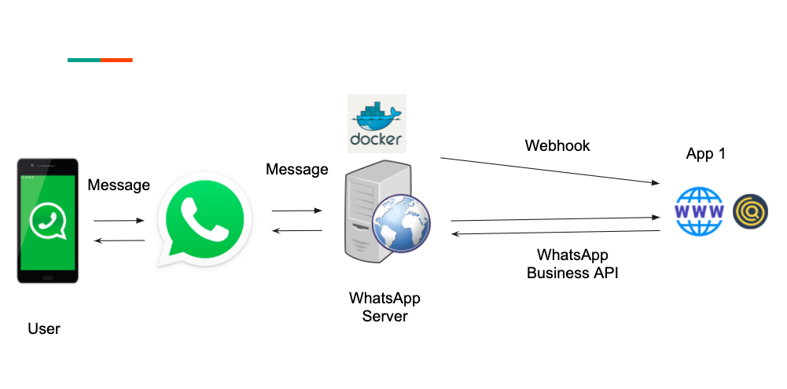

# Whatsapp Bot Workflow

Projeto de um robô desenvolvido com o conceito de workflow(fluxo de trabalho)

Para configurar o seu fluxo acesse o arquivo de configuração

``contexts.json``

Caso queira a dica é colocar esse fluxo json no MongoDB ou qualquer outro não NoSQL, e montar um frontend para
facilitar as configuração e entendimento da árvore de dados.

Este projecto pode ajuda-lo:
[bots-workflow-designer](https://github.com/toxtli/bots-workflow-designer)

Ou faça a integração via BotPress:
[BotPress](https://botpress.com/)